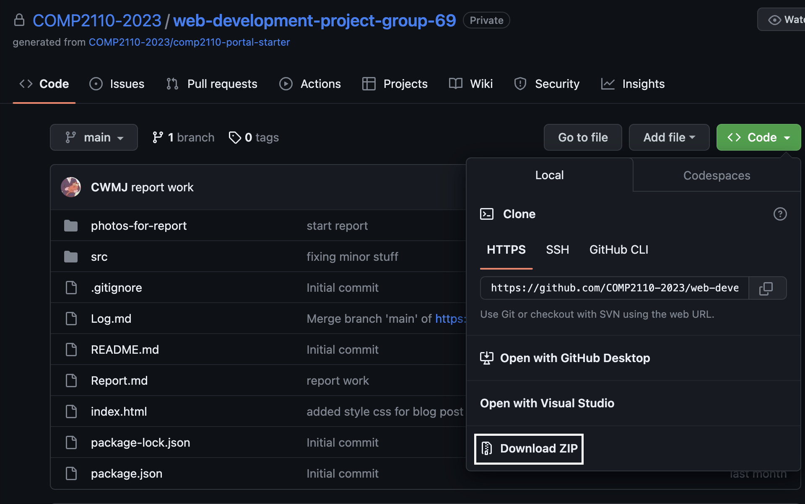
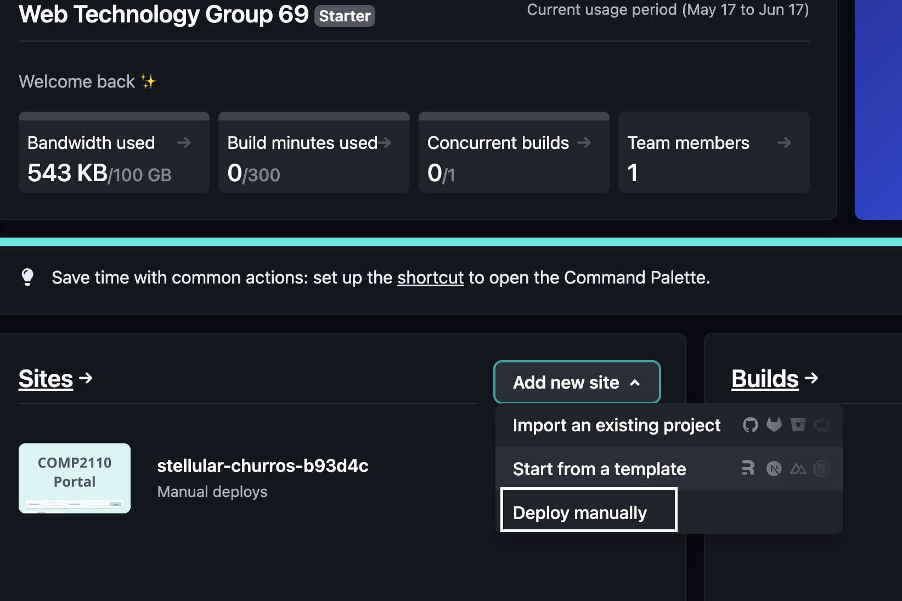
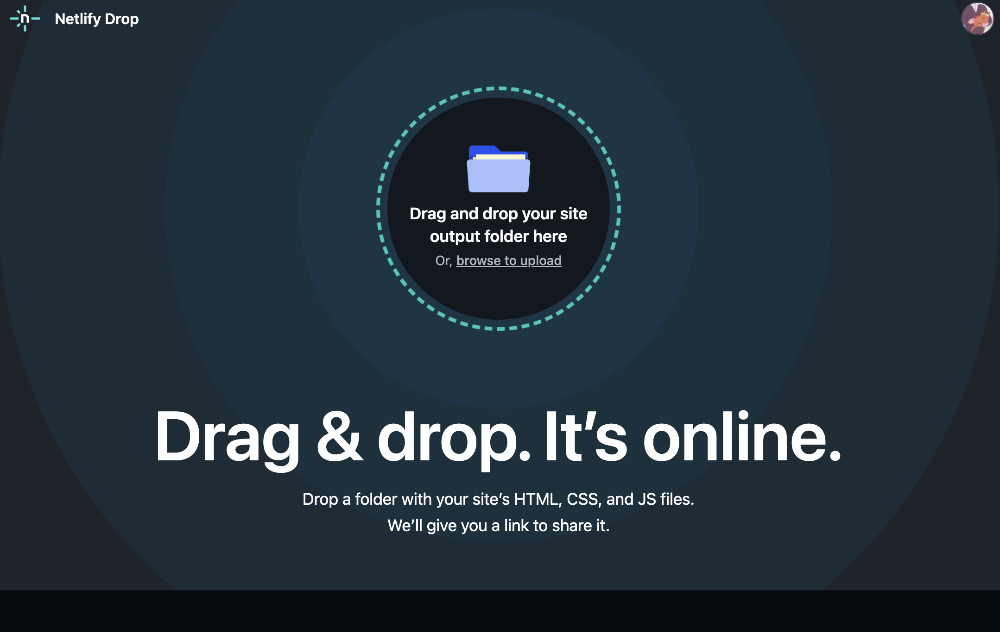

# Comp2110 Report

# Content Page

Question 1 | Deployment of website:	1

Question 2 | What we achieved:	4

Question 3 | What we found challenging:	5

Question 4 | What we found rewarding:	5

Question 5 | Individual reflection:	6

# Group69 Members:

Cameron Jones | 47193972

Socheata Cheth | 47349115

Rodolfo Guzman | 46500588

Vibolroath Leav | 46120386

word count: 2432

# Question 1 | Deployment of website:

After our group finished creating the website, it was decided that it would be a good idea to deploy it through Netifly. The website was created and saved on GitHub which made it very easy to turn it into an actual website. The steps to deploy the website we created as follows:

1.	Access the GitHub repository where the code was saved and download a zip file of the code needed for the deployment of the website. 
            (a) Since the GitHub repository we used for the assignment is private we need to manually add the code files to deploy the website (if public we could link the repo and deploy it that way)

2. Access Netifly (https://www.netlify.com/) and log in to your account or create a new one.

3. Once logged in, scroll down till you see Sites -> click on the "Add new site" and select the "deploy manually"

4.	Unzip the downloaded code from githhub from step 1 and drag and drop the folder into the the box where it says to

5.	Edit the settings such as website name, link etc to however you please.

Once this is all done, a link will be created and the link for our website is: https://stellular-churros-b93d4c.netlify.app/

Note: If the website needs to be updated regularly, it would be recommended that instead of doing drag and drop each time, put all the code into a public repository which can be connected to Netifly so whenever you push a change, Netifly would update the website.

# Question 2 | What we achieved:

For this assignment we achieved multiple things such as the creation of widgets and the ability to create a blog post when logged in. Our team was a group of 4 members and therefore we needed to create 4 widgets. The 4 widgets created were:

1. Random Number Trivia
2. Currency Conversion
3. Inspirational Quotes
4. Upcoming Country Holidays

Out of the 4, only 3 were achieved due to lack of teamwork. Out of the widgets that work, one displays a random fact about a random number, the other shows public holidays for x country which can be selected from a dropdown bar and the inspirational quote displays random inspirational quotes. Aside from the widgets we achieved the ability for a person to create and post a blog. In order for the user to create a blog, they need to log in with credentials which are valid and if so, once logged in a blog form will appear at the top of the screen where they can input a title and body and then post the blog. Once the blog is posted, the page is refreshed, and the user's blog will appear on the top of the blog post display.

Regarding the CSS and design aspect of the website, firstly, we chose to place the widget block, which contains all of the widgets, to the left side only as we concluded that it looks better for blogs with more extended word counts and it looks more modern as well. As for the color scheme, we chose the light blue color palette as we thought it would provide a gentle and inviting aesthetic to the overall feel of the website. Furthermore, the light blue color scheme helps the readability and accessibility of the website as it contrasts nicely against the black text, making it more readable and easier for the users to see and read.

# Question 3 | What we found challenging:

Some things we found challenging was implementing the blog. The main issue we had was making the blog send and appear on the blog forum. Initially we thought that we had the sending to the server down pact but not the displaying the blog. After our team investigated the issue we found it was also an issue sending to the server as well. The issue was it was posting the form information to the wrong server which would then make it not display on the blog forum (was sending the form to nowhere). After debugging and trial and error, we finally figured out the POST error and fixed the POST method within the blog script so that it would actually send the blog post information to the backend server and post it for the user to see.

Another issue was the Number Trivia widget not displaying once the website was deployed. According to Steve (Comp2110 Unit Conveyer) this is because it only operates over http, not https and Chrome by default blocks mixed content within the same page - it wants either all https or all http. So for next time we know that if we used the number widget we should proxy the API through an https proxy server.

There was also an issue with communication amongst our team as one of our team members was not in the same practical class as the rest of us, so sometimes trying to relay any information to them was a bit of challenge and sometimes the information wasn't properly understood either. The same way in return as well, they didn't communicate to us as much either so the rest of us didn't have a clue about what was being done or what was already done. This eventually led to one of our 4 widgets that was meant to be done, remain incomplete and commented out, since it would break the rest of the page.

# Question 4 | What we found rewarding:

A couple of topics that our team came to appreciate and understand to a much better degree in this assignment was the extensive use of API's in the creation of our widgets, as well as the design and publishing of a functional website,not so much in terms of creating a website as the HTML was already created for us. However, the use of CSS and JavaScript to create a nice looking website, along with creating widgets on the side of our website using API's given to us was both a challenging but rewarding experience. Firstly, we'll discuss the designing and use of CSS in the assignment and discuss why particular sets of code were used, what looked good and what didn't and why? Why was it enjoyable as well?

The CSS that was used was mainly the standard changing of background colours, editing the the margins and borders in the website as well to make the text look nice, as well as changing font size for headers and adding footer notes to the website too. It may not seem like much and look like really simple stuff, but these simple steps make a world of difference to the website, in terms of aesthetics. Everything from the text to the background looks a lot cleaner and easier to look at, than just a couple of black words with no font on a blinding white background. Doing this helped our team see that having a good looking website is just as important as having a functioning website too, so it was really good to see the improvements we could make to it while also properly understanding the reasoning behind doing it as well.

Next, is about the API's we used to help us create the widgets we implemented into our website. The API's used were already different sites or constantly updating blocks of text that we fetched from it and implemented them into variables that actually meant something to us. The data from the API's that we attached to variables could now be used properly in our code when constructing the widgets. Being able to properly understand why API's are created and used for the construction of different things like websites and applications was all really interesting and definitely a very useful skill that our team will take away from this assignment.

Another rewarding thing was we got to have a good understanding and experience regarding the implementation, understanding, and usage of APIs, authentication, retrieving data, and handling data. At first, we had a couple of issues regarding the website's blog posting function, but after researching and testing different things, we figured it out. We got to look at and inspect different information from the browser's console, which helped us understand how the process of retrieving, handling, and sending works.

Overall, getting to work with APIs, CSS, data handling, Javascript, and many other design aspects in this assignment are valuable learning experiences that help us understand the content of this unit. Also, as we progress further in our careers or studies, these experiences and skills will undoubtedly assist us.

# Question 5 | Individual reflection:

# Cameron Jones | 47193972
I chose to do the `number trvia widget` as I thought it was funky to display a wacky number trivia fact each time the page is refreshed or accessed. During the comp2110 classes I found adding the API widgets such as the star wars one challenging so I thought I would just stick to a simple API and work on the blogging section more. Some things I found challenging as a group was teamwork as some people left their work last minute which did not go down very well. I also struggled with implementing the blog but after lots of trouble shooting and trial and error I was able to make it work. I thought it was a visual issue at first but eventually realised that it was POSTING to the wrong server and fixed that which made life much easier.

# Socheata Cheth | 47349115
The widget that I created is `Inspirational quotes` because I thought that it would be nice to have inspirational quotes that appear randomly on the website. During this group project, I found everything was very challenging for me. In addition, I was also struggling with API and how to apply them. For example, I was not sure the types of API to be written in a static properties section, such as whether it is a string type, text type or array type, how many variables were needed in that section.At first, I was going to do a weather widget, but I seemed to not be able to import the original API link that is in the ReadMe section as well as the location that the user open the website, meaning I can not update the locations, depending on where the user is.Therefore, I decided to change my widget to a simple inspire quotes instead. While I was working on this widget, I also encountered some issues when fetching the data from API, I only got a pair of curly brackets with random quotes with an author that were separated by comma. After going through all the lecture video recording of API that is on ilearn, I was finally able to solve the problem to get the quotes with an author data appear according to the structure I want them to be. I also tried to work on a blog, but I was not able to solve it so I decided not to commit any changes at that time because the codes that I have changed might make things more complicated.

# Rodolfo Guzman | 46500588
The widget I chose to do was the `conversion widget`, this widget was meant to take the current exchange rates for currency around the world and properly exchange them into the currency that is selected by the user. The widget was meant to operate by getting all of the current exchange rates of the current date from an API, with each exchange rate connecting to a specific variable that was corresponding with the country it was exchanging from, for example; AED for United Arab Emirates Dirham was used. Then from here, that user would select another country it wants to exchange the currency from and the widget would do that. I originally wanted to have all of the countries and their exchange rates to be present in the final widget, but decided it may have been too ambitious of a project to do at the current time. Unfortunately, I was not able to complete the widget, so out of the 4 that were chosen, this was the only one that was not functional. I was overwhelmed with the amount of work I had to do in so little time, that I had no chance to complete this widget, but the hardest part for me while I was doing it was fetching the information from the API and connecting each part of it to a separate variable, I ran into a lot of errors with this, but I do believe I managed to figure it out in the end.

# Vibolroath Leav | 46120386
The widget that I implemented was the `Upcoming Country Holidays widget`, as I thought that it was useful and practical for users visiting the website. I was given the creative freedom of designing the widget however I liked, given the data from the API. As a result, this widget allows users to see upcoming holidays from each selected country which are available to select from the drop-down menu on the widget. The upcoming holidays are shown based on the current date so that only the upcoming holidays are shown and not all of the holidays. Furthermore, the widget provides users with the exact dates(YYYY-MM-DD) and the name of the holidays, which dynamically fetches and displays the most up-to-date holiday information for each selected country through the use of the API. One of the challenges I encountered was understanding the implementation of the API and its content, as I needed to parse the fetched data and present it to the users in a user-friendly format that is simple to understand. The main challenge that I encountered in this project was coming up with a way to handle the upcoming holidays, as I needed to filter and sort the holiday data to show only the upcoming ones based on the current date. For the filtering, I needed to compare each holiday's date to the current date to get the upcoming holidays to see which one is greater. Next, for the sorting, I compared the holiday dates and sorted them in ascending order based on their dates. There were many challenges that I had to face, but I am happy that I have overcome them.
